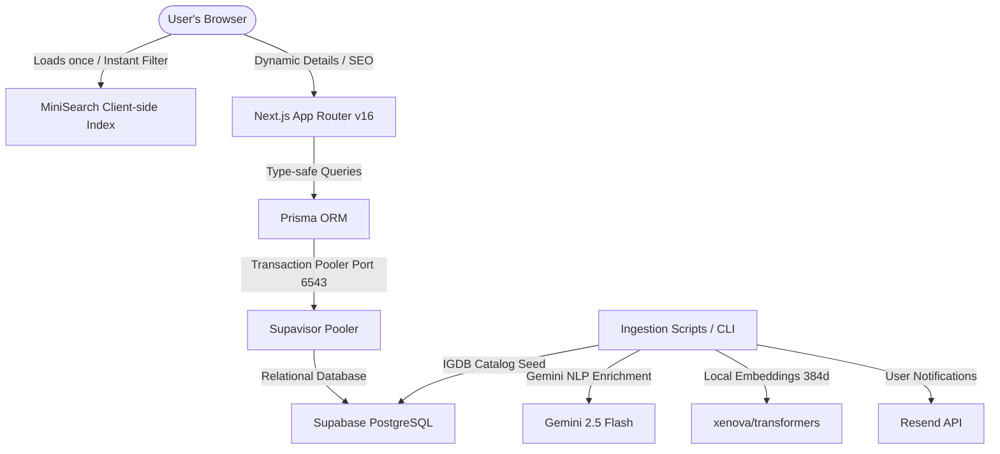

# hoGAMEGATA Project Context

This document serves as the comprehensive system context, architecture reference, and development roadmap for **hoGAMEGATA**, a minimalist, curated horror game discovery platform.

---

## 1. Core Technology Stack & Architecture

The application is structured to support instant local discovery with low-latency serverless routes and background data enrichment.

### Core Technologies
*   **Frontend & Routing**: [Next.js 16 (App Router)](file:///c:/Users/bapum/Desktop/gamegata/src/app) utilizing React 19, Tailwind CSS v4, and Shadcn/Base-UI components.
*   **Database & ORM**: [Prisma ORM](file:///c:/Users/bapum/Desktop/gamegata/prisma/schema.prisma) with [Supabase PostgreSQL](https://supabase.com). Includes `pgvector` for similarity embeddings.
*   **Connection Pooler**: **Supavisor** (Port `6543` in Transaction Mode for serverless runtime routes; Port `5432` in Session Mode for administrative tasks and Prisma migrations).
*   **Search**: Client-side typo-tolerant in-memory search using [MiniSearch](https://github.com/luacns/minisearch) for the primary catalog, backed by server-side PostgreSQL Full-Text Search (FTS).
*   **AI & Embeddings**:
    *   **Gemini 2.5 Flash** (via `@google/genai`) for Steam review scrapings & Scare Profile generation.
    *   **xenova/transformers** for running local vector embeddings (`vector(384)`) for semantic game recommendations.
*   **Email Gateway**: [Resend](https://resend.com) (configured to use the verified custom domain `gamegata.xyz`).

---

## 2. Main File & Folder Index

Below is an index of the primary files, directories, and scripts in the workspace:

### Application Routes & Business Logic
*   [`src/app/page.tsx`](file:///c:/Users/bapum/Desktop/gamegata/src/app/page.tsx): Main homepage, loading the initial catalog array into client-side `MiniSearch` for sub-second, typo-tolerant filtering.
*   [`src/app/game/[slug]/page.tsx`](file:///c:/Users/bapum/Desktop/gamegata/src/app/game/[slug]/page.tsx): Atmospheric, dynamically rendered game detail page displaying ratings, platforms, store links, screenshots, and AI-computed Scare Profiles.
*   [`src/app/api/`](file:///c:/Users/bapum/Desktop/gamegata/src/app/api): Contains backend API handlers:
    *   [`/api/games/route.ts`](file:///c:/Users/bapum/Desktop/gamegata/src/app/api/games/route.ts): Paginated game search and retrieval endpoint.
    *   [`/api/recommendations/route.ts`](file:///c:/Users/bapum/Desktop/gamegata/src/app/api/recommendations/route.ts): Vector-similarity recommendation handler.
    *   [`/api/stats/route.ts`](file:///c:/Users/bapum/Desktop/gamegata/src/app/api/stats/route.ts): Catalog analytics and counts.
    *   [`/api/waitlist/join/route.ts`](file:///c:/Users/bapum/Desktop/gamegata/src/app/api/waitlist/join/route.ts): Public registration endpoint for early access.
*   [`src/lib/`](file:///c:/Users/bapum/Desktop/gamegata/src/lib): Shared utilities and core engines:
    *   [`db.ts`](file:///c:/Users/bapum/Desktop/gamegata/src/lib/db.ts): Database client initialization and connection pooling helper.
    *   [`priceEngine.ts`](file:///c:/Users/bapum/Desktop/gamegata/src/lib/priceEngine.ts): Custom price aggregation engine interfaces.
    *   [`taxonomy.ts`](file:///c:/Users/bapum/Desktop/gamegata/src/lib/taxonomy.ts): Custom horror categorization taxonomy rules.

### CLI & Management Scripts (`/scripts`)
*   [`dev-gui.ts`](file:///c:/Users/bapum/Desktop/gamegata/scripts/dev-gui.ts): The developer portal administrative panel running on `localhost:4000`. Supports Postgres FTS rebuilds, Gemini NLP runs, and waitlist approvals.
*   [`ingest.ts`](file:///c:/Users/bapum/Desktop/gamegata/scripts/ingest.ts): Seeding script to query IGDB catalog and insert games in batch pools with in-memory deduplication.
*   [`enrich-scare.ts`](file:///c:/Users/bapum/Desktop/gamegata/scripts/enrich-scare.ts): Natural Language Processing (NLP) enrichment pipeline that uses Gemini AI to analyze reviews and construct multi-dimensional horror profiles.
*   [`sync-prices.ts`](file:///c:/Users/bapum/Desktop/gamegata/scripts/sync-prices.ts): Updates price metadata snapshots for storefronts.
*   [`setup_fts.ts`](file:///c:/Users/bapum/Desktop/gamegata/scripts/setup_fts.ts): Sets up standard and custom Full-Text Search indexes in PostgreSQL.

---

## 3. Feature Roadmap & Task Checklist

### Completed Features
- [x] **Horror Database Schema**: Decoupled relational tables mapping games, developers, publishers, genres, tags, platforms, storefront purchase links, waitlists, and price records.
- [x] **Optimized Ingestion Pipeline**: IGDB ingestion using batching concurrency (20 parallel query batches) and relation pre-seeding to reduce db writes by 66%.
- [x] **Unified Developer Portal GUI**: Administrative dashboard (`dev-gui.ts` on port 4000) mapping database indexing, waitlist approvals, and Gemini scoring runs.
- [x] **Custom Horror Scare Profile**: Semantic assessment scoring dread, gore, jump scares, psychological weight, tension, disturbing themes, and isolation.
- [x] **Waitlist Authorization Gateway**: Support for mock tokens and live Supabase Auth magic links.
- [x] **Resend Email Domain verification**: Configured for sending waitlist approval emails via `noreply@gamegata.xyz`.

### Pending Tasks & Scaling Roadmap
- [ ] **Decoupled RAWG Enrichment**: Move slow secondary metadata enrichment (Metacritic, Playtime, ESRB) into asynchronous background workers using a `rawgEnriched` flag, rather than blocking the primary ingestion queue.
- [ ] **Vector Recommendation Fine-Tuning**: Optimize cosine similarity calculations on `vector(384)` embeddings inside `src/app/api/recommendations/route.ts`.
- [ ] **Affiliate Price Comparison Engine**: Finish integration of CheapShark & IsThereAnyDeal APIs for live price comparison, using internal redirect routes (`/re?url=...`) to track analytics.
- [ ] **Cursor Pagination**: Replace traditional `OFFSET` query pagination with `id > cursor` pagination for large catalog fetches.

---

## 4. System Assumptions & Core Principles

> [!IMPORTANT]
> **Aesthetic Standard**: The frontend interface must look premium, atmospheric, and tailored for a horror audience (e.g., sleek dark themes, custom Google Fonts typography, glassmorphism, and minimal clean borders). Browser-default styling or unformatted elements are unacceptable.

> [!NOTE]
> **Database Asset Rule**: Never upload or save large binary files (like cover images or screenshot captures) directly to Supabase as SQL Blobs. The schema relies exclusively on direct CDN URL strings to keep database sizes minimal.

> [!WARNING]
> **Next.js & React 19 Boundary**: Next.js 16/React 19 has breaking changes. Always review deprecations and refer to internal node module guidelines if build exceptions crop up.

> [!TIP]
> **API Decoupling Principle**: IGDB fetches are critical. External secondary platforms like RAWG or Steam Scrapers should be optional enrichment layers that never block primary catalog reads or writes.
