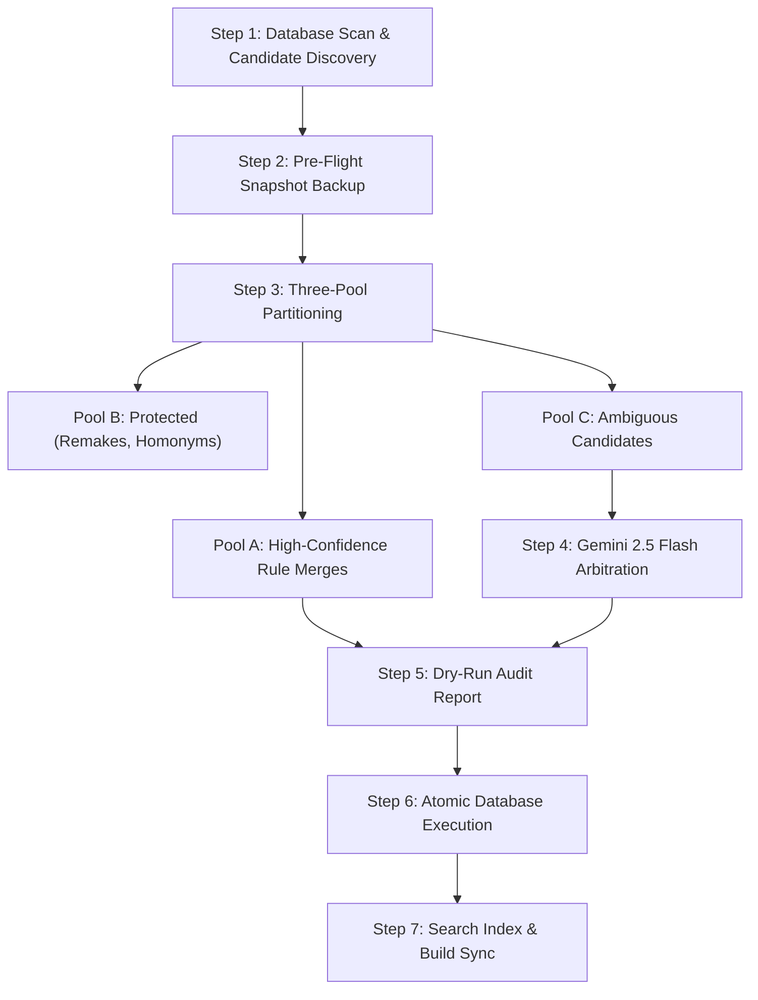

# Deduplication Pipeline Workflow

This document explains the end-to-end lifecycle of the deduplication pipeline, from the raw database scan to the final search index synchronization.

---

## The 7-Step Lifecycle

---

### Step 1: Database Scan & Candidate Discovery
The pipeline queries all active games in TursoDB (`WHERE status IS NULL OR status != 'hidden'`) and builds three candidate groupings:
1. **Exact Normalized Titles**: Games that share the exact same lowercase, trimmed title string.
2. **Punctuation-Invariant Titles**: Games whose titles match after stripping symbols like `:`, `-`, `®`, `™`, and curly apostrophes.
3. **Shared Storefront AppIDs**: Games that point to the exact same external store ID (e.g. Steam App ID `472870` or GOG product URL).

Any game belonging to a group with 2 or more listings is flagged as a candidate.

### Step 2: Pre-Flight Snapshot Backup
Before examining or modifying any data, the pipeline exports an offline JSON snapshot:
- Snapshot location: `backups/` and `backups/pass2/`
- Contents: Complete records of every candidate game, their developer links, genres, tags, platforms, and all `PurchaseLink` and `PriceSnapshot` entries.
- Purpose: If an unexpected error occurs, the database can be restored to its exact previous state without relying on manual backups.

### Step 3: Three-Pool Partitioning
The candidates are filtered through deterministic validation rules and divided into three pools:

- **Pool A (Refined Safe Merges)**:
  - Exact or punctuation-identical title matches.
  - Verified studio pedigree (same developer name or confirmed rebrand).
  - Clean storefront linkage (such as one entry having Steam and another having GOG/itch.io for the same product).
  - *Action*: Auto-queued for Golden Record consolidation.

- **Pool B (Strictly Protected Releases)**:
  - Matches that fail safety rules (different developers on itch.io, games released across different console eras, remakes vs. originals).
  - *Action*: Locked and protected. Zero changes applied.

- **Pool C (Ambiguous Review)**:
  - Cases that require human-like historical context (such as titles ending in `+`, potential studio rebrands, fan ports, or duplicate scraper runs with conflicting dates).
  - *Action*: Exported as tasks for AI arbitration.

### Step 4: Gemini 2.5 Flash Deep Arbitration
For tasks in Pool C, the pipeline formats the candidate pairs with full catalog metadata (title, year, developer, platforms, summary, and store links) and submits them to Gemini 2.5 Flash.

The model evaluates each candidate group using the **5-Point Verification Rubric** and responds with a strict JSON verdict:
- `shouldMerge`: `true` or `false`
- `primarySlug`: Which record to keep as the primary Golden Record
- `mergeSlug`: Which record to soft-hide
- `reason`: A concise, historical explanation for the decision

To prevent failures from network timeouts or API demand spikes, calls use:
- Batch chunking (10 to 20 tasks per call)
- Exponential backoff retry loops (retrying automatically on HTTP 503 or 429)

### Step 5: Dry-Run Audit Report
Before writing any changes to TursoDB, a complete audit report is compiled:
- Combines Pool A merges with AI-approved Pool C merges.
- Prints exact before-and-after listings with reasons.
- Displays summary counts and lets the operator inspect edge cases.
- Saves a machine-readable JSON report (`pass2_dry_run_report.json`).

### Step 6: Atomic Database Execution
Once the plan is approved, the execution script applies changes using batched atomic transactions (`rawDb.batch`):
1. **Reparent Links**: Any `PurchaseLink` on the secondary game is moved to the primary game ID. Duplicate store URLs are removed.
2. **Reparent Prices**: Historical `PriceSnapshot` rows are moved to the primary game ID.
3. **Merge Relations**: Developers, genres, tags, and platforms are copied to the primary game via `INSERT OR IGNORE`.
4. **Enrich Metadata**: If the primary game lacks a cover image, summary, or scare rating, but the secondary has one, the primary is updated.
5. **Soft-Hide Secondary**: The secondary game record is updated to `status = 'hidden'`. No games are hard-deleted.

### Step 7: Search Index & Build Sync
After the database commit:
1. **Search Index**: `scripts/generate-search-index.ts` queries all visible games and regenerates `public/search-index.json`.
2. **Build Test**: `npm run build:quick` runs Astro's build engine to verify that static routes and Cloudflare worker bundles build with zero errors.
3. **Audit Log**: The changes and verification counts are appended additively to `walkthrough.md`.
